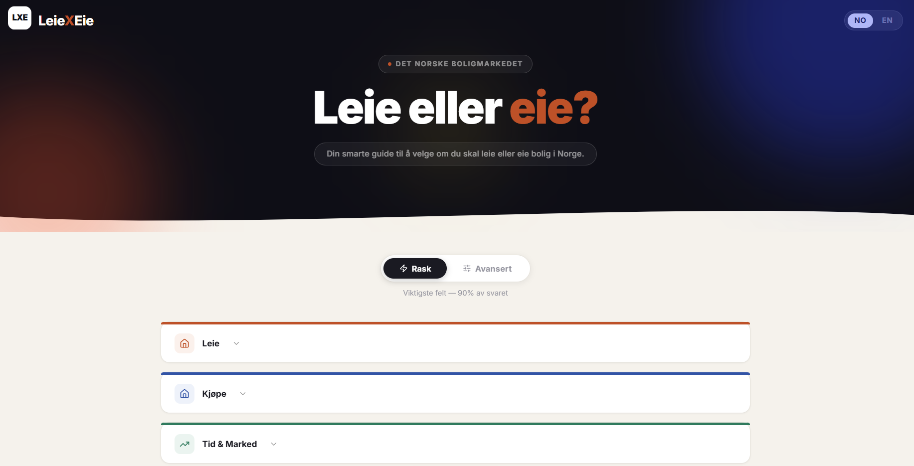
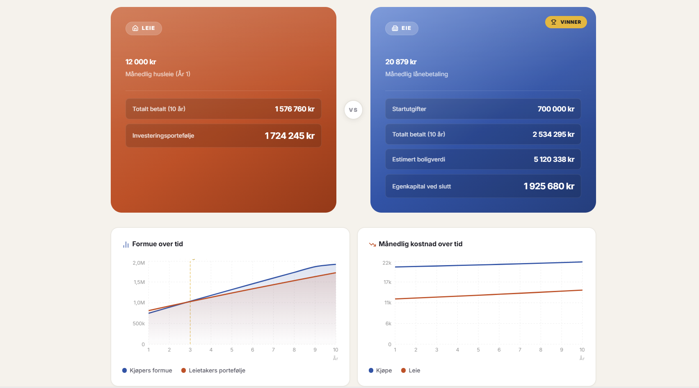
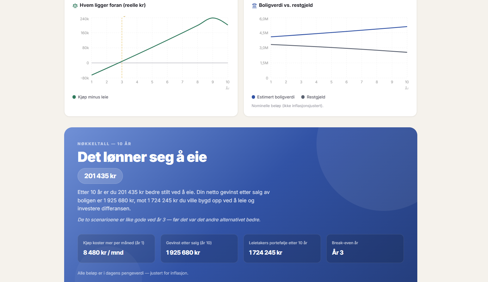
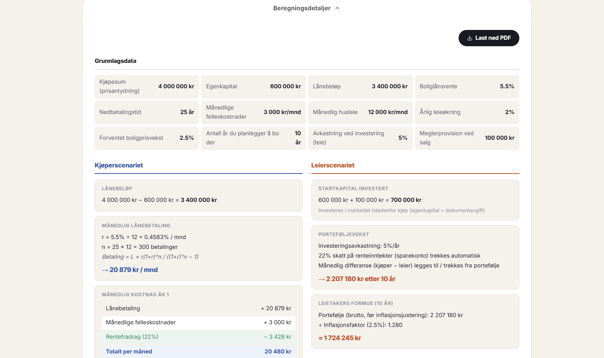
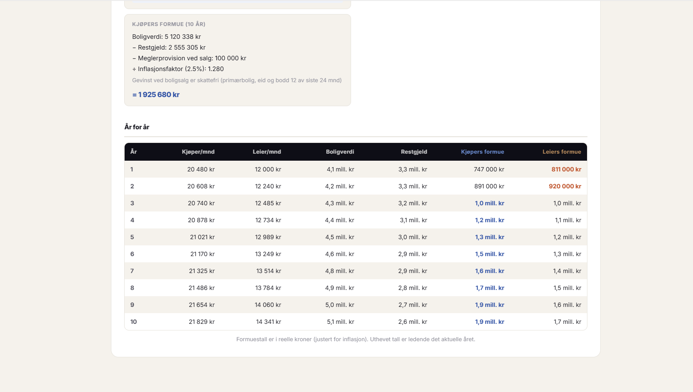

# LeieXEie

> Norwegian rent-vs-buy calculator — compare long-term net worth, not just monthly costs.

[English](#english) · [Norsk](#norsk)

---

## Screenshots



<table>
<tr>
<td></td>
<td></td>
</tr>
<tr>
<td></td>
<td></td>
</tr>
</table>

---

## English

**LeieXEie** ("rent vs. own") models two scenarios side by side — renting and buying — and tells you which leaves you wealthier after *N* years, in today's kroner.

### Features

**Quick mode** — the core comparison: rent and how it grows, purchase price, down payment, mortgage rate and term, monthly shared costs, stamp duty, broker fee, and how long you stay, plus price growth (which can be negative), inflation and a savings rate. Cooperative debt, wealth tax, BSU, ASK and detailed ownership costs are left out.

**Advanced mode** — full Norwegian financial model:

- Housing cooperative (borettslag) or freehold (selveier): borettslag skips the 2.5% stamp duty and adds shared debt (fellesgjeld) that is paid down over its own term, with tax-deductible interest
- Interest-only period with recalculated amortisation afterwards
- Mortgage rate change from a chosen year, with the payment recalculated on the remaining loan
- Maintenance costs inflation-adjusted year over year
- Municipal fees, home insurance, property tax
- Contents insurance, electricity, internet, and parking applied to both sides, so they do not change who comes out ahead
- BSU for the renter: the 10% tax deduction lowers the cost of renting, and the contribution earns the savings-account rate rather than the ASK return
- Security deposit (3 months rent) earning savings-account interest
- **Wealth tax**: primary residence valued at 25% of market value vs. financial assets at 80% — one of the largest structural advantages of homeownership in Norway. Couples taxed jointly get double thresholds
- **After-tax investment returns**: quick mode assumes a savings account (interest taxed at 22% yearly); in advanced mode ASK fund gains are taxed at 37.84% on sale after shielding; home appreciation remains tax-free

**Output:**

- Inflation-deflated net worth comparison (real kroner)
- Breakeven year detection
- Stress test of the monthly payment (rate + 3 percentage points, at least 7%, as in the lending regulations), including higher interest on shared debt and other debt priced at the stress rate
- Sensitivity grid: how the answer changes with house-price growth and mortgage rate
- Year-by-year breakdown table (costs, equity, portfolio growth)
- PDF export of the full breakdown
- Interactive charts (net worth over time, monthly costs)
- Norwegian and English UI

### How it works

**Buyer** — pays mortgage (with optional interest-only period) + HOA + all ownership costs. Builds equity as the property appreciates tax-free. Wealth tax on 25% of home value.

**Renter** — invests the down payment and closing costs upfront (minus a 3-month security deposit). Each month, whichever side has lower costs invests the difference. Quick mode: savings account interest taxed at 22% yearly. Advanced mode: ASK gains taxed at 37.84% on exit. Wealth tax on 80% of fund value and 100% of bank savings.

Both final net worths are deflated to today's kroner. The higher number wins.

### Stack

| Library | Purpose |
|---|---|
| Vite 5 + React 18 + TypeScript | App framework |
| Recharts | Interactive charts |
| @react-pdf/renderer | PDF export |
| react-i18next | Norwegian / English UI |
| lucide-react | Icons |

### Getting started

```bash
npm install
npm run dev
```

Open [http://localhost:5173](http://localhost:5173).

### Scripts

| Command | Description |
|---|---|
| `npm run dev` | Start dev server |
| `npm run build` | Production build |
| `npm run preview` | Preview production build |
| `npm run typecheck` | Type-check without emitting |
| `npm run lint` | ESLint |
| `npm test` | Vitest unit + golden tests (calculation engine, i18n parity, theme) |
| `npm run format` | Prettier |
| `npm run ci` | Typecheck, lint, test and build (same as GitHub Actions) |

### Disclaimer

For educational purposes only. Not financial advice.

---

## Norsk

**LeieXEie** regner på to alternativer side om side – å leie og å eie – og viser hvilket som gir høyest formue etter *N* år, i dagens kroner.

### Funksjoner

**Enkel modus** – kjernesammenligningen: husleie og husleievekst, kjøpesum, egenkapital, rente og nedbetalingstid, felleskostnader, dokumentavgift, meglerhonorar og tidshorisont, pluss prisvekst (som kan være negativ), inflasjon og sparerente. Fellesgjeld, formuesskatt, BSU, ASK og detaljerte eierkostnader er ikke med.

**Avansert modus** – full modell med norske skatteregler:

- Borettslag eller selveier: i borettslag betales ingen dokumentavgift (2,5 %), og fellesgjelden nedbetales over sin egen løpetid, med rentefradrag
- Avdragsfri periode med ny nedbetalingsplan etterpå
- Renteendring fra et valgt år, med nytt terminbeløp beregnet ut fra restgjelden
- Vedlikeholdskostnader justert for inflasjon hvert år
- Kommunale avgifter, boligforsikring og eiendomsskatt
- Innboforsikring, strøm, internett og parkering regnes med på begge sider, så de endrer ikke hvem som kommer best ut
- BSU for leietakeren: skattefradraget på 10 % senker kostnaden ved å leie, og innskuddet får sparerente i stedet for ASK-avkastning
- Depositum (3 måneders husleie) som gir sparerente
- **Formuesskatt**: primærbolig verdsettes til 25 % av markedsverdien, mot 80 % for aksjer og fond – en av de største strukturelle fordelene ved å eie bolig i Norge. Par som skattlegges samlet, får dobbelt bunnfradrag
- **Avkastning etter skatt**: enkel modus forutsetter sparekonto (renter skattes med 22 % hvert år). I avansert modus skattes ASK-gevinst med 37,84 % ved uttak, etter skjerming. Gevinst ved salg av egen bolig er skattefri

**Resultater:**

- Sammenligning av formue i dagens kroner (justert for inflasjon)
- Break-even-år: når det ene alternativet går forbi det andre
- Stresstest av terminbeløpet (rente + 3 prosentpoeng, minst 7 %, som i utlånsforskriften), med høyere rente på fellesgjeld og annen gjeld priset til stresstrenten
- Følsomhetstabell: hvordan svaret endres med boligprisvekst og rente
- Detaljert tabell år for år (kostnader, egenkapital og porteføljevekst)
- PDF-eksport av hele beregningen
- Interaktive grafer (formue over tid og månedlige kostnader)
- Norsk og engelsk språk

### Slik fungerer det

**Kjøper** – betaler boliglån (med valgfri avdragsfri periode), felleskostnader og alle eierkostnader. Bygger egenkapital etter hvert som boligen stiger i verdi, skattefritt. Formuesskatt beregnes av 25 % av boligverdien.

**Leietaker** – sparer egenkapitalen og kjøpsomkostningene fra start (minus 3 måneders depositum). Den som har lavest kostnad, sparer differansen hver måned. Enkel modus: renter på sparekonto skattes med 22 % hvert år. Avansert modus: ASK-gevinst skattes med 37,84 % ved uttak. Formuesskatt beregnes av 80 % av fondsverdien og 100 % av bankinnskudd.

Begge sluttformuene regnes om til dagens kroner. Den høyeste formuen vinner.

### Teknisk stack

| Bibliotek | Formål |
|---|---|
| Vite 5 + React 18 + TypeScript | Rammeverk for appen |
| Recharts | Interaktive grafer |
| @react-pdf/renderer | PDF-eksport |
| react-i18next | Norsk og engelsk språk |
| lucide-react | Ikoner |

### Kom i gang

```bash
npm install
npm run dev
```

Åpne [http://localhost:5173](http://localhost:5173).

### Skript

| Kommando | Beskrivelse |
|---|---|
| `npm run dev` | Starter utviklingsserveren |
| `npm run build` | Bygger for produksjon |
| `npm run preview` | Forhåndsviser produksjonsbygget |
| `npm run typecheck` | Typesjekker uten å kompilere |
| `npm run lint` | Kjører ESLint |
| `npm test` | Kjører enhetstester og fasittester med Vitest (beregningsmotor, like nøkler i begge språk, tema) |
| `npm run format` | Formaterer koden med Prettier |
| `npm run ci` | Typesjekk, lint, tester og bygg (det samme som GitHub Actions kjører) |

### Ansvarsfraskrivelse

Kun til informasjon. Ikke finansiell rådgivning.
