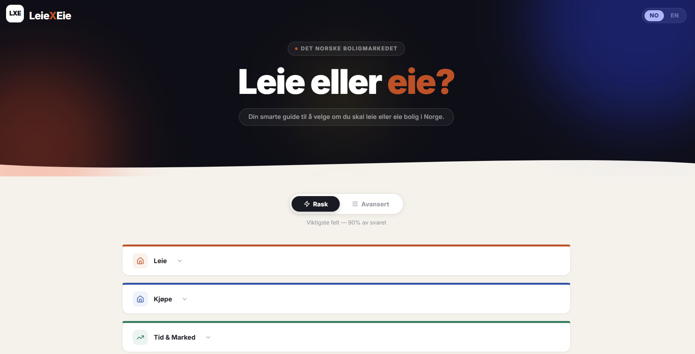
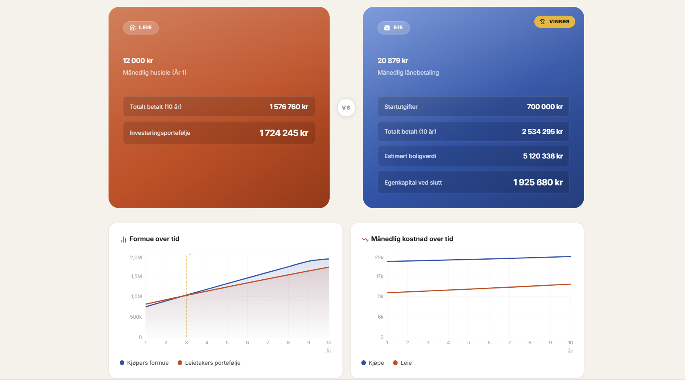
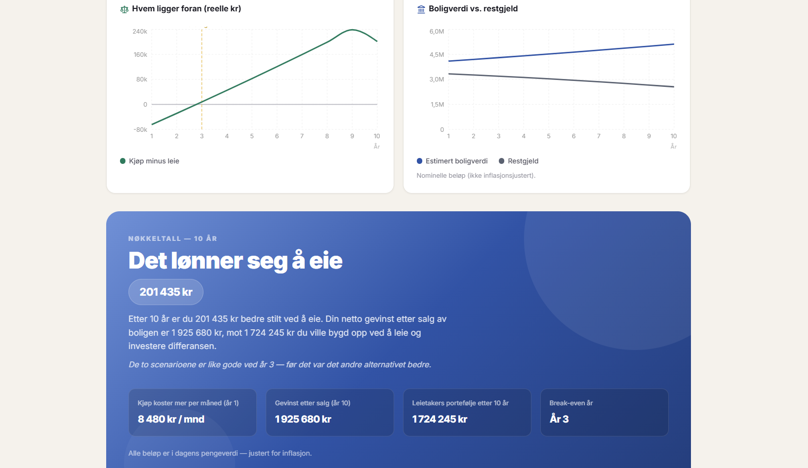
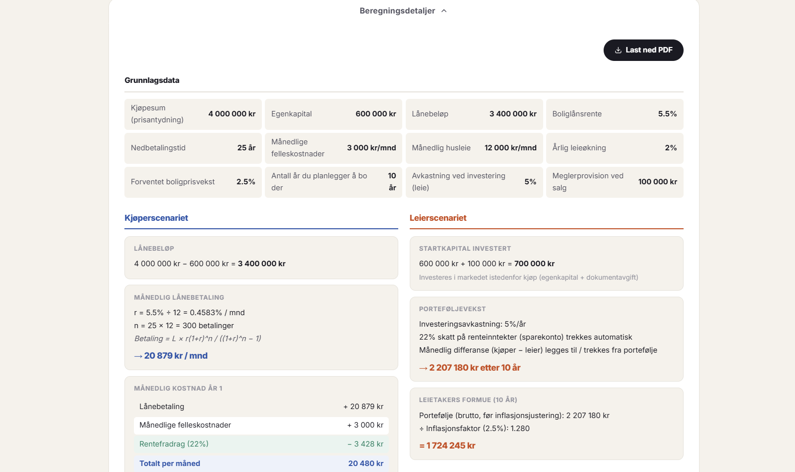
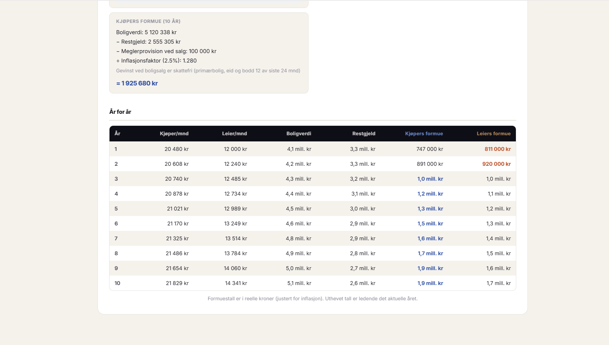

# LeieXEie

En leie- vs. eie-kalkulator tilpasset det norske boligmarkedet. Legg inn tallene dine og få en tydelig anbefaling basert på langsiktig nettoformue.

---

## Skjermbilder



<table>
<tr>
<td></td>
<td></td>
</tr>
<tr>
<td></td>
<td></td>
</tr>
</table>

## Funksjoner

- **Quick mode** — grunnleggende input:
  leiepris, kjøpesum, egenkapital, rente, felleskostnader og tidshorisont

- **Advanced mode** — full norsk finansiell modell:
  - Gjeld som permanent forpliktelse med egen rentefradragseffekt
  - Avdragsfri periode med senere overgang til nedbetaling
  - Vedlikeholdskostnader justert for inflasjon år for år
  - Kommunale avgifter, forsikring og eiendomsskatt
  - Innboforsikring, strøm, internett, parkering (strøm og internett inngår i begge scenarier for å unngå skjevhet)
  - **Leie-depositum og alternativkostnad** (3 måneders husleie, returneres nominelt ved slutten av perioden)
  - **Formuesskatt**: primærbolig verdsettes til 25 % mot 80 % for finansielle eiendeler — en av de viktigste strukturelle fordelene ved boligkjøp i Norge
  - **Etter-skatt avkastning på investeringer**: justerbar effektiv skattesats (standard 37,84 % under aksjonærmodellen); boligprisvekst er skattefri

- Inflasjonsjustert nettoformue (i dagens kroner)
- Beregning av break-even år
- Detaljert kalkulasjonsvisning (år-for-år kostnader, egenkapital og porteføljevekst)
- PDF-eksport av full beregning (`@react-pdf/renderer`)
- Interaktive grafer (Recharts)
- Norsk og engelsk språkstøtte (i18next)

## Hvordan det fungerer

Kalkulatoren modellerer to scenarier side om side:

**Kjøper** — betaler boliglån (med valgfri avdragsfri periode), felleskostnader og alle eierkostnader. Bygger egenkapital etter hvert som boligen øker i verdi (skattefritt). Formuesskatt beregnes med 25 % av boligverdi (mot 80 % for finansielle eiendeler).

**Leietaker** — investerer egenkapital og kjøpskostnader ved start (minus depositum tilsvarende 3 måneders husleie), og investerer deretter månedlig differanse mellom leie og boligeiers kostnader. Avkastning beskattes årlig etter valgt skattesats. Porteføljen inngår i formuesskatt med 80 % verdsettelse.

Begge scenarier justeres til dagens kroneverdi ved hjelp av inflasjon. Det alternativet som gir høyest nettoformue vinner.

## Teknologi

- [Vite](https://vitejs.dev/) + React 18 + TypeScript
- [Recharts](https://recharts.org/) for grafer
- [@react-pdf/renderer](https://react-pdf.org/) for PDF-eksport
- [react-i18next](https://react.i18next.com/) for språk (norsk / engelsk)
- [lucide-react](https://lucide.dev/) for ikoner

## Kom i gang

```bash
npm install
npm run dev
````

Åpne [http://localhost:5173](http://localhost:5173).

## Skript

| Kommando          | Beskrivelse                 |
| ----------------- | --------------------------- |
| `npm run dev`     | Start utviklingsserver      |
| `npm run build`   | Bygg for produksjon         |
| `npm run preview` | Forhåndsvis produksjonsbygg |

## Ansvarsfraskrivelse

Kun til utdanningsformål. Ikke finansielle råd.